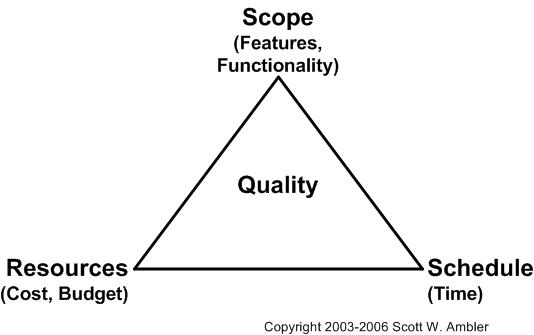

[home](../index) | [blogs](../blogs)

# Fixed Scope Sprints
## 2021/10/22

Scrum is popular. 

But so is the accidental struggle so many Scrum teams are having. Anti-patterns, misconceptions, misinterpretations, and plain ole ignorance pop up and it feels like a never ending game of whack-a-mole.

The mole that's been annoying me lately is the misinterpretation that sprints in Scrum are to be the timeboxed delivery of the planned (often dysfunctionally referred to as _committed_) scope that resulted from sprint planning.

We can throw the book at this one quite easily...

The [2020 Scrum Guide](https://scrumguides.org/scrum-guide.html) has at least a couple things to say about scope (emphasis mine)...

> **Scope may be clarified and renegotiated** with the Product Owner as more is learned.

> The Sprint Goal is created during the Sprint Planning event and then added to the Sprint Backlog. As the Developers work during the Sprint, they keep the Sprint Goal in mind. If the work turns out to be different than they expected, they collaborate with the Product Owner to **negotiate the scope of the Sprint Backlog** within the Sprint without affecting the Sprint Goal.

If Scrum isn't about delivering a specific scope by a specific time then what is it about? Let's consult the guide again...

> Commitment: Sprint Goal
>
> The Sprint Goal is the single objective for the Sprint. Although the Sprint Goal is a commitment by the Developers, it provides flexibility in terms of the exact work needed to achieve it

The Sprint Goal is what sprints are all about. It is the _single objective for the Sprint_. Note the second sentence referring to scope. The scope to achieve the goal is _flexible_.

So to sum up: **It is normal and it is okay in Scrum to change your plan and your scope**. Scrum is an agile framework. Agile is about flexing scope to maximize customer value. This is reflected in the manifesto through the values... 

_Customer collaboration over contract negotiation_. 

_Responding to change over following a plan_. 

... and through the principle...

_Welcome changing requirements, even late in development. Agile processes harness change for the customer's competitive advantage..._

Why can't we get good enough at estimates and we can get everything done that we planned?

Complexity and uncertainty are a given in software development (this is what makes estimates near irreducibly hard by the way). The many decades old [project management triangle](https://en.wikipedia.org/wiki/Project_management_triangle) serves as a reminder that we can't have all three without giving in to something in some way.

Timeboxed "sprints" aren't a trick to beat this. Consider the following as proof. Your resources are fixed because you're not adding team members at the beginning of the sprint. The schedule is fixed because your sprint is timeboxed. If, then, the plan is fixed then your scope fixed. Thus, all three variables are fixed and you are headed for burnout and/or disaster _in the same manner as typical plan driven (i.e. waterfall) projects are_.

So, let's stop running our sprints like waterfall projects, shall we?