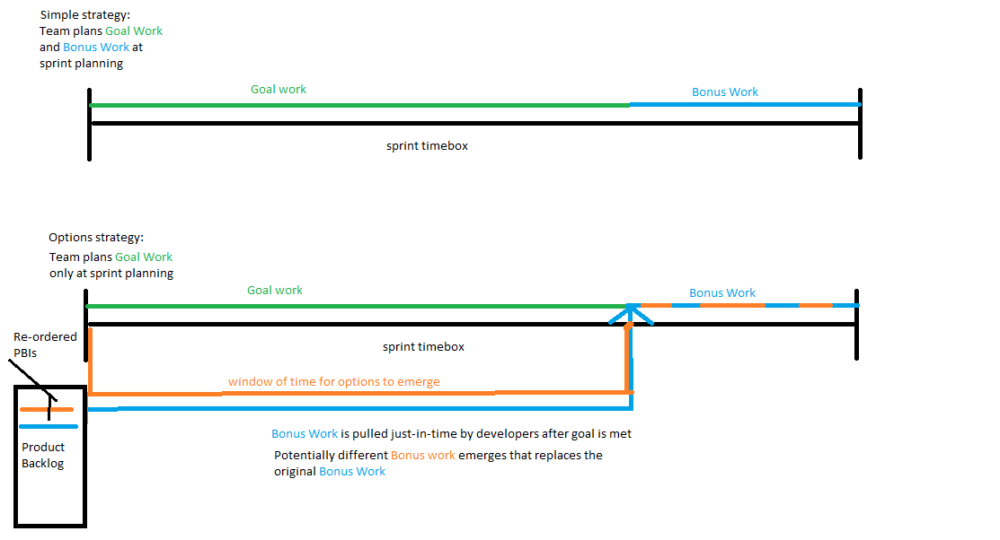

[home](../index) | [blogs](../blogs)

# Small Goals and Options Thinking
## 2021/05/04

Scrum is popular. Very popular.

Scrum is so popular it doesn't take long to see certain classes of problems among teams adopting Scrum. One of these problems centers around the sprint length and the team coming up with a relevant goal that fits within the timebox.

Often, teams will have no problem finding a goal to fit. When a goal is too big the Scrum team makes short work of making it smaller. When a goal is too small the team expands the goal.

A particular problem arises though when the team thinks the goal is too small _and that goal cannot be bigger_.

One simple strategy employed is to simply include non-goal work into the sprint at sprint planning. Scrum has no quarrels about non-goal related work in the sprint so it fits within the framework. When the team meets the goal they then move on to this "bonus" work. This "bonus" work is simply backlogged and re-prioritize in the event the Scrum team finds the goal related work is different than they were expecting.

This strategy works well but there is another clever way that allows us to exercise [options thinking](https://dzone.com/articles/lean-tools-options-thinking)

Instead of pre-loading the sprint during sprint planning with the non-goal related work the team simply foregoes this exercise. When the sprint goal has been met, the developers pull non-goal related work into the sprint in a just-in-time fashion and follows the same rules as the simpler model.

This strategy has benefits to both the product owner and developers. The sprint planning focuses only on the goal. The product owner is free to delay the decision of what is the most logical backlog order until the last responsible moment. For the developers, the sprint backlog contains only goal related work so focus is maintained until that goal is reached.

Most importantly, however, this gives the greatest value to the software because the team can _respond to change over following a (sprint) plan_

I'm going to throw the word _Kanban_ out there because if you are familiar with a Kanban strategy you have recognized the source of this strategy.

Lastly, if you're a visual learner my crappy ms paint depiction of both strategies is depicted below.

